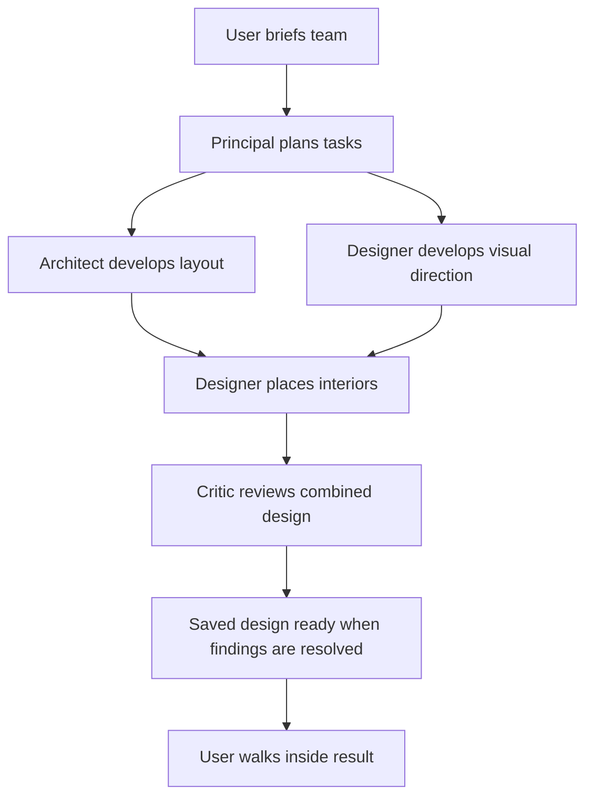

# AGENTS.md

## Project: AI Architecture Studio

This project is an interactive multi-agent architecture studio.

The user enters a virtual 3D architecture firm, briefs an AI team, watches agents collaborate and use tools, steers individual agents while they work, and eventually explores the generated design inside a final presentation space.

The goal is NOT to create a collection of independent chatbots.

The goal is to create the feeling of working inside a real AI-powered architecture company.

This document combines product direction with implementation guidance. The current runtime uses a dependency graph: independent specialists can work concurrently, and dependent work waits for saved outputs. The [collaboration guide](docs/concurrent-agents.md) describes execution; the [readiness review](docs/agent-design-review.md) tracks remaining gaps. Product examples below are illustrative unless identified as runtime contracts.

---

# 1. Core Experience

The primary interaction loop describes the user experience, not a fixed agent execution order:

1. User gives a natural-language brief
   - Voice
   - Text

2. The Principal Architect / Boss Agent interprets the brief.

3. The Boss Agent identifies:
   - Goals
   - Constraints
   - Missing information
   - Ambiguities
   - Required specialists

4. If necessary, the Boss asks the user a small number of high-impact clarification questions.

5. The Boss creates a structured project brief.

6. The Boss delegates a graph of tasks to the required specialists, with explicit dependencies and deliverables.

7. Independent agents work concurrently inside their individual virtual rooms/workspaces. Dependent tasks consume saved prerequisite outputs.

8. The user can physically navigate to an agent's room and inspect:
   - Current task
   - Public progress and status explanations
   - Files
   - Tool activity
   - Computer screen
   - Current outputs

9. The user can directly steer an agent.

Example:

> Make the exterior red instead of yellow.

This should become a contextual change request rather than restarting the entire project.

10. Agents update their work and propagate relevant changes.

11. When necessary, agents may call a meeting to resolve:
   - Conflicting requirements
   - Design trade-offs
   - Cost issues
   - Technical issues
   - User-requested changes

12. The final design is assembled.

13. The user enters the final presentation room and explores the resulting architecture/design.

---

# 2. Product Philosophy

## 2.1 Agents should do real work

Agents should not merely role-play conversations.

Where possible, agents should:

- Edit files
- Write code
- Generate structured data
- Modify 3D scenes
- Analyse designs
- Use external tools
- Run commands
- Inspect outputs
- Produce persistent artefacts

The virtual office visualises real agent activity.

---

## 2.2 The 3D environment is the interface

Do not treat the 3D world as decoration around a chatbot.

Physical locations should correspond to system concepts.

Examples:

### Meeting Room
Used for:
- Initial briefing
- Cross-agent discussions
- Design reviews
- Conflict resolution

### Principal Architect Office
Used for:
- Project overview
- Delegation
- Requirements
- Task planning
- Global steering

### Architect Room
Used for:
- Building layout
- Spatial planning
- Massing
- Architectural decisions

### Interior Designer Room
Used for:
- Materials
- Furniture
- Colours
- Interior styling
- Theming

### Critic / Reviewer Room
Used for:
- Design review
- Requirement checking
- Finding inconsistencies
- Challenging assumptions

### Final Presentation Room
Used for:
- Final model
- Walkthrough
- Before/after comparisons
- Design explanation

---

# 3. Initial Agent Team

For the hackathon MVP, prefer a small number of highly differentiated agents.

Use approximately four primary agents.

## 3.1 Principal Architect / Boss

Responsibilities:

- Understand the user's request
- Clarify missing requirements
- Maintain global project context
- Break the project into tasks
- Delegate tasks
- Track dependencies
- Coordinate agents
- Resolve ownership conflicts
- Decide when meetings are necessary
- Integrate final outputs

The Boss should NOT perform every task personally.

The Boss should primarily coordinate.

---

## 3.2 Architect

Responsibilities:

- Overall architectural concept
- Building shape
- Floor plan
- Space allocation
- Structural organisation at a conceptual level
- Exterior architecture
- Spatial relationships

Example outputs:

- Building specification
- Room layout
- Scene geometry instructions
- Architectural model changes

---

## 3.3 Interior / Visual Designer

Responsibilities:

- Colours
- Materials
- Furniture
- Lighting
- Decorations
- Theme implementation
- Character/IP-inspired visual concepts where appropriate

Example:

If the user requests a Pokémon-inspired building, this agent may translate that into:

- Colour palette
- Decorative motifs
- Furniture concepts
- Lighting
- Interior styling

The Designer owns materials, material assignments, furniture and lights. It must escalate structural changes to the Architect through coordination; the current proposal merge rejects Designer edits to structural geometry, spaces, floors, spawn and metadata, including notes.

---

## 3.4 Critic / Design Reviewer

Responsibilities:

- Compare current output against user requirements
- Identify contradictions
- Detect missing requirements
- Evaluate usability
- Evaluate visual coherence
- Challenge weak decisions
- Suggest improvements

The Critic should not criticise for the sake of generating dialogue.

Only raise meaningful issues.

---

# 4. Shared Project State

Agents must operate on shared persistent project state.

Do NOT rely on chat history as the sole source of truth.

Conceptual state outline (actual contracts are in [shared/design.ts](shared/design.ts) and persistence is in [worker/src/store.ts](worker/src/store.ts)):

```json
{
  "project": {
    "id": "project_001",
    "name": "Pokemon House",
    "status": "active"
  },

  "brief": {
    "original_request": "",
    "summary": "",
    "goals": [],
    "constraints": [],
    "preferences": [],
    "open_questions": []
  },

  "design_reference": {
    "path": "project/design.json",
    "revision": 0
  },

  "tasks": [],

  "decisions": [],

  "change_requests": [],

  "artifacts": [],

  "agents": {},

  "events": []
}
```
---

# 5. Task Model

Every meaningful unit of agent work should be represented as a task.

The Principal emits `PlanSchema` from [shared/collaboration.ts](shared/collaboration.ts). A planned task uses this runtime shape:

```json
{
  "id": "visual_direction",
  "title": "Create exterior colour concept",
  "agent": "designer",
  "kind": "visual_direction",
  "objective": "Develop a playful Pikachu-inspired palette while architecture is being planned.",
  "dependencies": [],
  "deliverables": [
    "Exterior palette",
    "Material and lighting direction"
  ]
}
```

Task kinds are `architecture` (Architect), `interior` and `visual_direction` (Designer), and `review` (Critic). Plans contain 2–8 tasks with unique IDs, valid dependencies and no cycles. A final Critic task must depend transitively on every other task. For a new design, interior placement must depend on architecture; visual direction can start alongside architecture.

Ready tasks run in batches of up to two distinct specialists. Tasks owned by the same specialist are serialized. Each batch reads a common saved design revision, completes its work, and integrates proposals before downstream tasks start. Do not assume that every request needs every specialist or a mandatory shell-review stage.

Persisted tasks add run identity, status, detail, base revision and output artifact references. The Activity board exposes this real task state. Possible statuses:

* queued
* blocked
* in_progress
* review
* completed
* cancelled
* failed

---

# 6. Steering / Change Requests

User steering is a first-class feature.

When a user enters an agent's room and gives feedback, do NOT treat it as a completely new project prompt.

Create a contextual change request for an instruction to modify the design. Questions should be answered without starting design work; typed intent routing remains an implementation gap.

Example of the current `ChangeSchema` request shape:

```json
{
  "instruction": "Make the exterior red instead of yellow.",
  "agent": "designer",
  "elementId": null,
  "baseRevision": 3,
  "operationId": "9b2f01fe-bfe8-4cc0-8578-135b07815612"
}
```

The responsible agent should:

1. Interpret the change.
2. Determine affected artefacts.
3. Determine whether other agents are affected.
4. Apply the change.
5. Update project state.
6. Notify the Boss when the change has global implications.

In the current runtime, steering received during an active run is queued for the next run. It does not interrupt an in-flight task or rewrite its graph. A selected room provides context; the validated task kind determines actual ownership.

---

# 7. Local vs Global Steering

Local changes should stay with the relevant specialist. Principal coordination must not force unrelated specialists to redo their work.

## Local change

Example:

> Make this sofa blue.

Handle directly within the relevant agent.

Currently, a selected single-element colour change uses a deterministic Designer patch followed by Critic review, without a Designer workstation. Other finishes-only changes can use a Principal-planned Designer/Critic graph without an Architect task.

---

## Global change

Example:

> Actually make the building twice as large.

This likely affects:

* Architecture
* Interior
* Cost
* Scene generation
* Existing dependencies

Escalate to the Boss.

---

# 8. Meetings

Agents should NOT constantly hold meetings.

Meetings should occur only when coordination creates value.

Product-level reasons to call a meeting include:

* Two agents disagree
* A requirement affects multiple domains
* A major design decision is required
* A dependency is blocked
* The user requests a review
* A major change request affects multiple agents

Illustrative meeting record (not a separate runtime database schema):

```json
{
  "id": "meeting_004",

  "topic": "Exterior redesign",

  "participants": [
    "principal_architect",
    "architect",
    "interior_designer"
  ],

  "reason": "User requested a major visual redesign.",

  "decisions": [],

  "status": "active"
}
```

Meetings must produce decisions or tasks.

Avoid conversations that do not modify project state.

The implemented meeting triggers are overlapping design proposals and findings from final review. The Principal produces a persisted decision or correction plan with meeting events. A conflicting task can be rerun once against the latest revision. Final review can trigger one correction round and another review; unresolved findings leave the project in `review`. General autonomous meeting requests and live graph replanning remain future work.

---

# 9. Agent Communication

Agent-to-agent communication should be concise and operational.

Bad:

> Hello architect! I think your design is wonderful. What do you think about changing the roof?

Better:

> Roof geometry conflicts with the new lighting concept.
> Proposed change: increase roof clearance by 0.8 m.
> This affects scene geometry and lighting placement.
> Approve?

Agent conversations exist to coordinate work.

They are not the product themselves.

Workstation tasks can call `report_coordination` to persist a handoff or cross-domain concern. Collected messages are saved with task results and supplied to downstream dependencies. Visual-direction tasks return a structured coordination field. These messages do not directly dispatch another agent, change ownership or mutate the running graph.

---

# 10. Event System

Important activity should be represented as events.

Example:

```json
{
  "type": "task_started",
  "agent": "architect",
  "task_id": "task_012",
  "timestamp": "..."
}
```

Useful event types:

* project_created
* user_message
* clarification_requested
* clarification_received
* task_created
* task_started
* task_completed
* task_cancelled
* agent_message
* meeting_started
* meeting_ended
* change_requested
* change_applied
* artifact_created
* artifact_updated
* tool_started
* tool_completed
* error
* review_required
* final_design_ready

The 3D frontend can use these events to animate the office.

Example:

`task_started`

could cause the agent avatar to walk from the meeting room to its office.

The current Activity board displays persisted tasks, dependencies, deliverables and active specialists. Any room animation should follow these actual events, including simultaneous activity, rather than implying a fixed turn-taking sequence.

---

# 11. Tool / Computer Use

Agents may receive access to isolated environments such as Docker containers.

The current implementation uses E2B workstations for tool-backed design and review tasks. Visual-direction tasks produce a structured artifact without a workstation. Each task releases its own workstation when finished; saved files outlive the live computer session. The global limit remains two computers, with existing budget reservations and shutdown accounting enforced.

Each agent workspace should ideally expose:

* Filesystem
* Terminal
* Browser/tool interface
* Generated artefacts
* Logs

Agent computer activity should be observable by the user where feasible.

Important:

The frontend representation of computer use should be generated from actual execution state rather than fake animations wherever possible.

---

# 12. Artefacts

Agent outputs should be persistent artefacts.

Examples:

* JSON specifications
* Images
* Floor plans
* 3D models
* Scene graphs
* Code
* Materials
* Render configurations
* Reports

Illustrative artefact record (see `Artifact` in [shared/design.ts](shared/design.ts) for the current client contract):

```json
{
  "id": "artifact_013",

  "type": "scene",

  "name": "Pokemon House Exterior",

  "owner": "architect",

  "version": 3,

  "path": "/projects/project_001/scene/exterior.json",

  "related_tasks": [
    "task_012",
    "task_023"
  ]
}
```

Prefer versioned artefacts rather than destructive overwrites.

---

# 13. Design Representation

The architecture output is a machine-editable canonical JSON design, validated by `DesignSchema`. Three.js renders that design in the browser. Blender scenes, GLB exports, images and floor plans are derived artifacts; none replaces the canonical source of truth.

For the hackathon MVP, optimise for:

1. Fast generation
2. Easy AI editing
3. Browser rendering
4. Incremental changes

Preserve the structured JSON → Three.js pipeline and stable element IDs so incremental changes and concurrent proposals remain mergeable. Generated canonical models can be explored through **Design → Walk inside**. The final presentation-room exhibit and Spline/imported-model walkthrough integration are separate unfinished work.

---

# 14. Boss Agent Brief Generation

The Boss should convert natural-language input into a structured brief.

Example input:

> Build me a futuristic Pikachu-themed house for four people. I want it colourful but still something that could plausibly exist.

Example output matching the current `BriefSchema` (`request`, `summary`, `goals`, `constraints`, `questions`):

```json
{
  "request": "Build me a futuristic Pikachu-themed house for four people. I want it colourful but still something that could plausibly exist.",
  "summary": "A colourful, futuristic Pikachu-inspired home for four people.",
  "goals": [
    "Pikachu-inspired visual identity",
    "Colourful and playful futuristic design"
  ],
  "constraints": [
    "Suitable for four occupants",
    "Plausible architectural design"
  ],
  "questions": [
    "Would you prefer one or two floors?"
  ]
}
```

---

# 15. Clarification Policy

Do not interrogate the user with ten questions before beginning.

Ask only questions that significantly affect the result.

Good questions:

* How many people should the building support?
* Is this realistic architecture or fantasy architecture?
* Do you want one or multiple floors?

Low-value details can be inferred and changed later through steering.

Default philosophy:

**Start quickly. Refine interactively.**

The current brief schema allows at most three clarification questions. A clarification pauses design dispatch and ends that run; automatic answer-and-resume is not implemented. Keep this limitation explicit in demos and implementation plans.

---

# 16. Agent Behaviour

All agents should:

* Maintain awareness of their role.
* Avoid duplicating another agent's responsibilities.
* Read project state before acting.
* Produce persistent outputs.
* Record important decisions.
* Respect dependencies.
* Start independent work concurrently when the scheduler permits it.
* Consume saved prerequisite results and coordination messages.
* Submit proposals against the assigned base revision; preserve unrelated fields and stable IDs.
* Keep actions explainable.
* React to steering without unnecessarily restarting work.
* Escalate cross-domain changes.
* Prefer execution over excessive discussion.

---

# 17. User Experience Principle

The user should always understand:

### What is happening?

Example:

> Architect is generating the first floor layout.

### Why is it happening?

Example:

> This layout supports the four-person occupancy requirement.

### Who is doing it?

Example:

> Architect Agent

### Can I change it?

Whenever practical, yes.

---

# 18. Hackathon MVP Scope

Avoid building a full architecture platform.

The demo should show independent work, meaningful dependencies and visible saved changes. One possible initial plan is:



During work, the user visits rooms and inspects real tasks and tools. Meetings happen when a conflict or review finding needs a decision. Demonstrate a contextual Designer change, its saved revision and the refreshed model. Steering submitted during work applies in the next run; it does not interrupt the current model call. Use the Design view for the current walkthrough while the final presentation-room exhibit remains unfinished.

---

# 19. Demo Scenario

Default demo scenario:

> Design a futuristic Pokémon-inspired home.

Possible initial requirements:

* Two floors
* Four occupants
* Pikachu-inspired
* Bright and playful
* Large living room
* Gaming room
* Pokémon display area

During the demo, intentionally create a design that uses a yellow exterior.

Then demonstrate steering:

> I don't like the yellow exterior. Make it red instead.

The Designer proposes a material change to the canonical design. The coordinator validates and saves the revision, and the renderer refreshes from it.

The updated building becomes visible in the final model.

This showcases:

* Natural-language interaction
* Delegation
* Multi-agent collaboration
* Tool use
* Persistent project state
* Live steering
* 3D output

---

# 20. North Star

The experience should feel like:

> "I hired an AI architecture firm and walked into their office while they were working."

Not:

> "I opened four ChatGPT windows inside a 3D game."

---

# 21. Canonical Design State

Agents must edit a canonical `project/design.json` rather than directly owning the live 3D world state.

A renderer/compiler reads the canonical design and turns it into the Three.js scene. The shared project state references this design file as the source of truth rather than maintaining a competing copy.

The core pipeline is:

```text
Voice/text → Boss → tasks → agents → project/design.json → renderer → 3D world
```

Here, tasks form a dependency graph and independent agents execute concurrently. They submit base-relative proposals; the coordinator integrates them into the canonical design through serialized, revision-checked commits. Merge non-overlapping fields by stable IDs. Never silently overwrite conflicting edits or let a cancelled run publish a revision.

Steering should apply an incremental change to the canonical design, persist the updated artefact version, and refresh the renderer.

Example:

```text
"Make the roof red" → scoped material proposal → persisted design version → renderer refresh → roof changes
```

Preserve unaffected design elements and record the change request, affected artefacts, and relevant events.

If any task execution in a batch fails, wait for sibling executions to settle and publish none of that batch's proposals. Integration is not a multi-proposal transaction: if a later proposal cannot be reconciled, preserve earlier successful commits and the failed proposals for inspection.

---

# 22. Current Implementation Boundaries

- At most one queued or in-progress run per user is allowed across projects. A design run executes a bounded graph with at most two distinct specialists per batch. Coordination messages do not dynamically replan it.
- The initial concept or selected reference is frozen for a run and supplied to every dispatched specialist. Image concepts and Blender renders are separate artifact workflows.
- Typed questions currently enter the change queue, and clarification answers do not automatically resume a blocked brief. These are routing gaps to fix, not desired interaction rules.
- This run's instruction reaches its specialists and Critic. A durable effective brief that retains requirements from all previous steering rounds still needs refinement.
- Review helpers check a small set of design conditions. Schema validity and safe-spawn controls do not prove room connectivity, usable stairs or complete geometric correctness.
- Generation and rendering are disabled in the checked-in Worker configuration. Mocked tests do not establish paid-provider execution or live deployment quality.

Keep [README.md](README.md), the [collaboration guide](docs/concurrent-agents.md), the [readiness review](docs/agent-design-review.md) and the [active prompt library](prompts/README.md) aligned when these contracts change. Preserve historical Draftroom documents as explicitly labeled references.

<!-- BEGIN:nextjs-agent-rules -->

# This is NOT the Next.js you know

This version has breaking changes — APIs, conventions, and file structure may all differ from your training data. Read the relevant guide in `node_modules/next/dist/docs/` (resolved from this file's directory; in monorepos the `next` package may not be visible from the repo root) before writing any code. Heed deprecation notices.

This block is written and re-added by `next dev` — verify at `node_modules/next/dist/server/lib/generate-agent-files.js`. Removing it from a diff only re-creates the uncommitted change; committing it with your work keeps the tree clean.

<!-- END:nextjs-agent-rules -->
