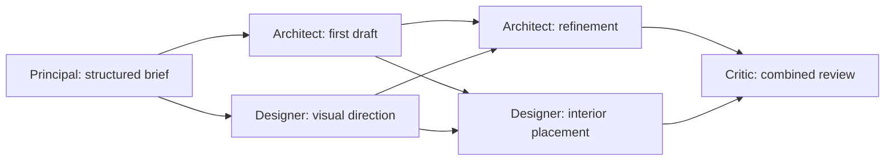

# Atelier

An AI architecture studio with four specialists, observable tool work, persistent design revisions and an explorable 3D office and building. The Principal plans tasks and dependencies; independent specialists can work concurrently. The Architect develops layout and structure, the Interior Designer handles materials, furniture and lighting, and the Critic reviews the combined result.

Proposal specialists have 24 tool turns and 12 minutes of shared model/tool time inside a 13-minute checkpoint. Inspection and submission remain mandatory; failed authoring saves a bounded, unpublished draft when available. The normal computer budget remains one hour per user/day, with an explicit local run/day override supporting up to one additional hour. See the [runtime guide](docs/concurrent-agents.md) and [local allowance configuration](docs/ENVIRONMENT.md).

The local preview needs no external keys. Live generation uses the configured OpenAI account and an E2B sandbox; see [the setup and cost guide](docs/FREE-MODE.md).

The canonical design is `project/design.json`. Three.js renders it in the browser; isolated E2B workstations compile Blender and GLB artifacts. Steering updates the existing project rather than creating an unrelated design.

Design specialists author a bounded `proposal.json` file with reusable wall/opening, stair/void and mesh-roof helpers. They inspect actual proposal renders before submitting; their final model response contains only a summary. Validated meshes survive browser rendering, Blender export and navigation. The Critic receives exterior, ground/first-upper-floor plans and an interior view. See the [authoring guide](prompts/proposal-guide.md) and [quality diagnosis and implementation](docs/model-quality-diagnosis.md).

The [collaboration guide](docs/concurrent-agents.md) explains scheduling, proposal merging and correction rounds. Activity shows the current task graph, dependencies, actual active specialists and each saved change request's progress.

The [user journey guide](docs/user-journey.md) walks through entering the website, giving a brief, watching the team collaborate, reviewing the generated design and walking inside it, with current interaction gaps called out.

## How the team works

After a saved brief starts a team run, the Principal clarifies high-impact unknowns. New designs use a bounded draft-first delivery graph; existing-design changes and corrections use Principal-authored plans:



Up to two distinct specialists run together when their dependencies are complete. Each batch uses the same saved design revision and produces separate results. The coordinator merges compatible proposals into versioned canonical JSON; downstream tasks receive their prerequisites' saved outputs and coordination messages.

The first draft has a six-minute work allowance and still requires inspection/submission; this is not an end-to-end latency promise. Visual direction runs alongside it with a two-minute allowance. Once committed, the draft is visible in Design and Presentation and exportable as JSON, browser GLB and floor plans from Files. Architecture refinement and interior placement then run concurrently against that draft, preserving agreed room bounds. Optional Blender GUI polishing is deferred to refinement. Final review and the existing single correction round remain required before readiness.

Conflicting proposals trigger a Principal decision and one targeted retry. Final review can trigger one correction plan and another review; unresolved findings leave the project in `review`. A finishes-only change can involve just the Designer and Critic. A selected single-element colour edit uses a deterministic patch without a Designer workstation.

Steering during an active run queues for the next run. Activity tracks **Queued → Working → Applied → Reviewed**, with saved revisions, review findings and failures kept distinct. Each team run saves an `effective-requirements.json` artifact containing the stored brief and ordered previously applied user amendments. Planning, specialists and review receive this shared record alongside the persisted current instruction; later feedback overrides earlier requirements only for the subject and scope it changes. Conversation routing distinguishes questions, brief additions, clarification answers and design changes. Pending Principal questions and accepted answers persist; answering all required questions queues a linked continuation of the briefing already requested. See the [user journey](docs/user-journey.md) and [readiness review](docs/agent-design-review.md). Saved canonical models are explorable through **Design → Walk inside** or **Presentation → Walk inside saved design**. The exhibit’s E interaction enters the same latest saved revision and offers a return to the studio. Spline/imported-model integration remains unfinished.

## Run locally

Requires Node.js 22+ and Python 3 for compiler-contract tests.

```sh
npm ci
npm run setup:local
```

In separate terminals:

```sh
npm run worker:dev
```

```sh
npm run dev
```

Open **http://127.0.0.1:3000**. Without Clerk configuration, loopback development uses one local owner; this bypass is disabled in production. Projects persist in the local Wrangler database, and the initial courtyard model is marked as a sample.

`setup:local` creates a local credential-encryption key in `worker/.dev.vars.local` only if that file does not exist, generates Worker types, and applies local database migrations. It does not supply external service credentials. The development frontend defaults to the Worker at `http://127.0.0.1:8787`. See [.env.local.example](.env.local.example) for frontend settings and [worker/.dev.vars.example](worker/.dev.vars.example) for Worker secrets; preserve existing local files when adding values.

For an existing checkout, run `npm run worker:types` and `npm run db:local` after pulling binding or migration changes. Apply [migration 0008](worker/migrations/0008_project_creation_requests.sql) before using this Worker version: it makes browser-draft connection retries reuse the original project. **Connect & start team** reconnects a browser draft to the available studio API with stable project and run identities; failed replies preserve the draft for retry. The project picker combines browser drafts and shared projects without duplicating a connected copy.

Saved project creation no longer has the old ten-project beta cap. Reconnection reuses the saved server project ID; an older missing creation receipt is recovered only when owner, name and brief still match exactly. API rate limits, active-run limits and model/sandbox spending controls remain in force.

Job starts return structured coordinator errors to both the API and live voice, preserving specific blockers such as an unsaved brief. Accepted jobs use the existing `runs.workflow_dispatched` outbox for every job kind: a durable alarm retries unconfirmed dispatch with the same Workflow ID and frozen inputs. Lost provider confirmations do not mark the job failed or allocate a second job. Stopping work cancels the saved request and fences dispatch; failed/cancelled runs are never restarted by that alarm. No additional schema is needed beyond the existing migrations. Deploy the Worker and required migrations together; a frontend-only publish cannot update this path.

The **Projects → Delete** button asks for confirmation. Browser drafts live in `localStorage` under `atelier-local-projects`; deleting one removes only that draft and its local connection receipt, not any connected server project. Connected projects are stored in the backend: deletion hides the project and removes linked drafts on this device, while retaining server files and usage records for administrative recovery (there is no restore UI). Stop active work and end live voice before deleting a connected project. API keys and unrelated projects are preserved. Apply [migration 0009](worker/migrations/0009_project_deletion.sql) before deploying this Worker version; it adds recoverable deletion and prevents new work from being admitted to deleted projects.

### Build targets

`npm run build` creates the standard Next.js production application; `npm start` serves it at **http://127.0.0.1:3000**. Configure `NEXT_PUBLIC_CLERK_PUBLISHABLE_KEY` before building, and `CLERK_SECRET_KEY` plus `ATELIER_WORKER_URL` for the server. The backend must accept that Clerk identity and the frontend origin. Production mode requires sign-in even on loopback; use `npm run dev` for the development identity without Clerk. The standard build explicitly disables Sites authentication so a shell setting cannot accidentally put ChatGPT sign-in into a Next deployment.

`npm run build:sites` creates the separate ChatGPT Sites package in `dist/client`, `dist/server/index.js` and `dist/.openai/hosting.json`. It enables ChatGPT sign-in, omits Clerk from the client, and routes requests through [the Sites adapter](sites/index.ts). That adapter requires the hosting platform's authenticated identity headers, an HTTPS `ATELIER_WORKER_URL` and a `SITES_PROXY_SECRET` matching the API Worker. Deploy this package through Sites; `npm start` does not run its adapter. Both targets use `.next` as build intermediates, so run `npm run build` again before starting Next after a Sites build.

The API Worker and its database migrations are deployed separately from either frontend. Building a frontend does not deploy the Worker, change its feature flags, or enable paid services. [Proxy contract tests](tests/sites-proxy.test.ts) cover authenticated forwarding and streamed responses without contacting providers. The existing `scripts/check-live-flow.mjs --production` uses a direct backend test identity and bypasses the Sites adapter; a real signed-in public journey is still needed to verify hosting integration.

## Explore and steer

- **Studio / Design** switches between the office and the current building.
- **Orbit** lets you drag to rotate and scroll to zoom.
- **Click to walk** shows a visitor in both views. Click/tap a clear floor to follow a path around obstacles; another click replaces the route. Drag to orbit, and press Escape to stop. Routes follow connected rendered slab/stair surfaces with enough clearance; unreachable targets display a message. Use Cutaway to expose interior floors.
- **Walk inside** explores at eye level using WASD and mouse look; Escape releases the mouse. The help dialog and [walkthrough guide](docs/walkthrough.md) describe controls and navigation limits.
- Choose a room or specialist to inspect their task, send a contextual change, or open an available live workstation. Room controls select the workspace and reset the walking start; they do not automatically walk the visitor there.
- In the design view, select an element to give steering a precise target. **Cutaway** exposes the interior for inspection.
- **Files** provides canonical JSON, GLB export, floor plans, saved artifacts and comparison with the previous saved revision when available.
- **Activity → Your changes** retains submitted instructions, targets, progress, revision references and review outcomes, including stopped or failed requests. **Current requirements** exposes the stored brief and applied feedback in order. Activity also shows running specialists, dependencies, deliverables, saved revisions and real tool events.

WASD and E interaction belong to **Walk inside**. Click walking stops for dialogs/workstations or when the window loses focus; click a new destination to continue. Geometry or cutaway changes reset its starting point safely. Routes allow steps up/down of at most 0.2 m, so a raised floor needs a connected step or staircase to reach lower ground.

Start with a brief such as “Design a futuristic Pokémon-inspired home for four people, with two floors, a generous living room and a yellow exterior.” Then select an exterior element and ask the Designer to make it red. The sample and your saved project are distinct; actual generation and steering require the live services below.

Once that selected-element change is applied, later work receives it as a scoped requirement amendment. Adding a balcony should preserve the red element and unrelated requirements. A request that never reaches the applied milestone is excluded from applied amendments; an applied amendment remains recorded if review fails or the run is stopped afterward. “Applied” means the plan's canonical writes were integrated; “Reviewed” identifies the Critic's outcome and may still include findings. The record supports consistent follow-up work but does not prove that a model obeyed every requirement.

## Live services

The code contains a Cloudflare Worker backend with D1 metadata, R2 artifacts, Durable Object coordination and Workflow execution. Standard Next deployments use Clerk; the Sites build uses ChatGPT sign-in through its hosting adapter. OpenAI calls use a personal key saved through Settings, falling back to the server's `OPENAI_API_KEY`. Agent desktops use E2B, and Blender rendering runs on those desktops.

The configured defaults are `gpt-6-astra` with explicit `high` reasoning for the design team, `gpt-6-astra` with API-default effort for delegated voice tools, and `gpt-live-1` for native speech. Structured agent calls allow up to 64,000 output tokens per response, including reasoning; existing task deadlines still apply. See [the environment guide](docs/ENVIRONMENT.md) for exact files and model settings.

### GPT-Live 1 voice input

After `npm run setup:local`, add `OPENAI_API_KEY=...` to **`worker/.dev.vars.local`**, preserving the existing encryption key. Restart `npm run worker:dev`. The Next.js root `.env.local` does not configure Worker secrets. For a deployed Worker, set the secret with `npx wrangler secret put OPENAI_API_KEY --config worker/wrangler.jsonc --env staging` (or `production`) and enable `VOICE_ENABLED` for that environment. An environment key pays for users who have no personal key saved; removing a personal key restores that fallback.

Local voice is enabled independently of design generation. You can save a spoken brief and discuss a project while `GENERATION_ENABLED=false`; generating or applying changes still requires generation and E2B to be configured. Apply the database migrations when upgrading (`npm run db:local` locally).

Create a project (or choose **Use voice to brief**), select a specialist, and click **Live voice**. Allow the microphone on HTTPS or localhost. Select a model element before calling to include its context. Changing specialist, project or selected element ends the call; reconnect for the new context. End call stops the microphone; design work continues separately.

Spoken requirements are saved incrementally, including short first details. Extra requirements can be appended while Principal questions are open without erasing answers or starting work; the voice backend refreshes the question version before answering. The brief retains its 8,000-character limit and reports a specific capacity error instead of silently dropping new details. Failed voice tool actions appear in Activity, and only confirmed saves are announced as saved. Voice routing uses low reasoning effort with its existing 1,800-token cap; specialist design effort and caps are unchanged. See [Responses delegation settings](https://developers.openai.com/api/docs/guides/live-delegation#reduce-backend-latency).

The browser exchanges SDP through the authenticated backend. GPT-Live 1 handles speech; a Responses backend reads project context and routes brief details, clarification answers and explicit changes through the same domain operations as typed messages. Pending questions carry stable IDs and a version; voice saves only the user's actual answers. Partial answers remain saved, and completing the required answers requests continuation without another Start action. Saving the initial brief still requires an explicit **Start team briefing** or meeting instruction before generation. Questions receive answers without entering the change queue. Server controls validate every action and revision, and the browser receives only voice status and transcripts. Calls close after 15 minutes. [Official WebRTC setup](https://developers.openai.com/api/docs/guides/voice-webrtc?api=live), [GPT-Live delegation](https://developers.openai.com/api/docs/guides/live-delegation).

Provider access, real microphone/audio behavior and a full paid design run still need a live smoke test after the key is added. Protocol and persistence tests use mocked provider responses/local storage.

```sh
npm run desktop:build
npm run desktop:benchmark
```

These commands consume remote resources. The benchmark writes actual outputs and timing data to `.atelier/benchmark/`; it never fabricates successful renders. Keep production generation OFF until the release checks pass.

## Image concepts and edits

Add `OPENAI_API_KEY` to `worker/.dev.vars.local`, apply `npm run db:local`, and restart the Worker. Local image generation is enabled by default and works without E2B. In a saved project, open **Files → Visual concepts** to generate a Flare concept, edit the current model view or a generated reference with Sunburst, and choose a direction. Applying an image direction to an existing model also requires the 3D generation/E2B setup.

Design runs build the editable 3D model directly from the brief; they never generate an image automatically. Image generation is optional and runs only when requested in Visual concepts. A selected original concept can remain background direction across later revisions, frozen for each run; accepted steering overrides conflicting image features. Explicit image edits and applications still require the current revision. Image requests produce one medium-quality PNG, save provenance and usage, and have a separate allowance of 12 attempts per account per UTC day. See the [integration guide](docs/image-generation-integration.md) for flags, persistence, cancellation and current geometry limits. Automated image tests use mocked provider responses; verify live access with the configured account.

## Prompts and documentation

The [active prompt library](prompts/README.md) contains shared instructions and the five imported role files, adapted to Atelier's four active roles. Director maps to Principal; Analyst is reference-only. [worker/src/prompts.ts](worker/src/prompts.ts) composes the active Markdown into model instructions while keeping briefs and tool evidence as separate runtime input.

Five detailed hypothetical-site briefs are available for the [AI startup office](prompts/projects/01-ai-startup-office.md), [courtyard library](prompts/projects/02-courtyard-library.md), [Pikachu house](prompts/projects/03-pikachu-house.md), [waterfront cultural centre](prompts/projects/04-waterfront-culture.md) and [sky garden tower](prompts/projects/05-sky-garden-tower.md). Copy the brief text into the New project form. The 40-floor tower exceeds the current four-floor schema and needs an agreed smaller scope; its original requirements are preserved for future development.

The [Draftroom migration index](docs/draftroom/index.md) links the original vision, README, prompts, presentation direction, decisions and evidence. Historical Spline/Supabase architecture and test results remain clearly identified as Draftroom references. [AGENTS.md](AGENTS.md) remains Atelier's current project guidance.

The [agent design review](docs/agent-design-review.md) records current correctness gaps and refinement priorities. The [GPT Image 2.5 integration guide](docs/image-generation-integration.md) documents saved concepts, reference-image edits and applying a chosen direction to the canonical model.

## Code and checks

- [components/Studio.tsx](components/Studio.tsx): studio interface, brief, steering and navigation controls.
- [components/World.tsx](components/World.tsx): office, design renderer and first-person exploration.
- [shared/design.ts](shared/design.ts) and [shared/geometry.ts](shared/geometry.ts): canonical schema and derived geometry.
- [shared/collaboration.ts](shared/collaboration.ts): task-plan validation, role ownership and three-way design merging.
- [worker/src/team.ts](worker/src/team.ts): concurrent task batches, dependency handoffs, coordination decisions and bounded review corrections.
- [worker/src/ai.ts](worker/src/ai.ts) and [worker/src/workflow.ts](worker/src/workflow.ts): model invocation, real tools and project-run orchestration.
- [scripts/blender_compile.py](scripts/blender_compile.py): canonical design to Blender/GLB compilation.

```sh
npm run worker:types
npm run typecheck
npm test
npm run build
npm run worker:check
```

Tests run real local D1, R2 and Durable Objects through Miniflare, verify signed Clerk-style JWT ownership, concurrent commits, cancellation fences, budget admission, credential encryption, and shared browser/Python geometry. They do not make paid AI or E2B calls.

## Code map

| Location                                          | Responsibility                                          |
| ------------------------------------------------- | ------------------------------------------------------- |
| `components/Studio.tsx`, `World.tsx`, `Voice.tsx` | Project UI, walking world, explicit voice controls      |
| `app/api/studio/[...path]/route.ts`               | Same-origin authenticated streaming proxy               |
| `shared/`                                         | Canonical schema, geometry, furniture and budget limits |
| `worker/src/index.ts`                             | Authenticated public operations                         |
| `worker/src/coordinator.ts`                       | Revision publication and voice sideband control         |
| `worker/src/workflow.ts`, `ai.ts`                 | Persistent specialist jobs and real tools               |
| `worker/src/budget.ts`, `desktop.ts`              | Compute admission, leases and private desktops          |
| `scripts/blender_compile.py`, `blender_asset.py`  | Canonical compilation and custom mesh publication       |

Spline remains optional asset authoring. The walking world is implemented directly in React Three Fiber/Rapier; no Spline subscription or exported interaction runtime is required.
