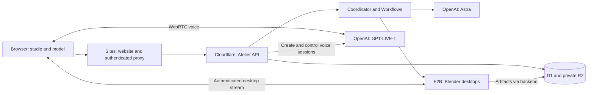

# Sites hosting and Blender compute

**Budget update:** the subsequent zero-cost requirement supersedes the paid E2B/cloud recommendation below. It remains an architecture option only. Use [FREE-MODE.md](FREE-MODE.md) for the current local preview and the limitations of permanently free hosting/AI.

Proposed 2026-09-13 after the request to consider Sites. This is a deployment assessment, not a completed migration. No Site, database, bucket, desktop, or paid plan was created during this assessment. The existing Vercel deployment path remains usable while the Sites path is validated.

## Recommended separation

| Part | Host | Responsibility |
|---|---|---|
| Studio website | Sites, after compatibility validation | Serve the interactive React/Three.js app and authenticated HTTP proxy |
| Project backend | Our separately deployed Cloudflare Worker | Authenticate ownership, coordinate revisions, call OpenAI and E2B, stream project events |
| Durable jobs | Cloudflare Workflows and Durable Objects | Resume work, serialize commits and enforce compute admission |
| Durable storage | Cloudflare D1 and private R2 | Project records, encrypted user keys, canonical designs, models, renders and checkpoints |
| Specialist computers | E2B Desktop | Temporary isolated Linux desktops with Blender, Python, browser and editor |
| Models | OpenAI API | GPT-6 Astra for reasoning/tools; GPT-LIVE-1 for speech |

The 3D office and model preview render on the visitor's computer. Blender runs remotely. Agent reasoning runs through OpenAI; the desktop provides the files and applications that the agent operates. Hosting the website does not itself host a Linux desktop or provide rendering compute.

## What changing to Sites involves

The installed Sites runtime serves static assets and Cloudflare Workers-compatible server bundles. Its server isolate has 128 MB of memory. It cannot run a Blender executable or a Docker daemon inside the website Worker.

Atelier currently uses stock Next.js 16, Clerk middleware, and a Node-targeted `/api/studio/[...path]` route. Its successful `next build` is not evidence that it is ready for Sites. A static export would also remove the server proxy/authentication path, so it does not satisfy the existing product.

The first migration candidate is an **additional Vinext build path** that preserves the React source and existing Next development/build path. Cloudflare currently recommends Vinext for Next.js applications on Workers. It reimplements the Next.js API surface using Vite; this is a compatibility change, not a rename. OpenNext is a possible alternative for adapting stock Next build output, subject to its supported features and the Sites packaging contract. [Cloudflare Next.js guide](https://developers.cloudflare.com/workers/framework-guides/web-apps/nextjs/), [OpenNext adapter](https://developers.cloudflare.com/workers/framework-guides/web-apps/opennext/).

Before switching hosts:

1. Validate the Workers build against Clerk 7, Next 16 route parameters/middleware, Three.js/Rapier WASM, and dynamic client imports. Preserve the current lockfile and avoid scaffolding over this application.
2. Confirm the platform path for the existing Clerk public signup flow. Private Sites can add a ChatGPT access gate, which is distinct from Atelier's project ownership. Do not silently replace Clerk identities or reinterpret existing project owners as Sites identities.
3. Verify the proxy's cookies, origin checks, streaming bodies, SSE reconnects and artifact downloads in the hosted runtime. Keep the separate backend's Durable Objects and Workflows in its own Cloudflare deployment; do not assume Sites provisions those bindings.
4. Package a server-backed Site with the required Worker entrypoint, client assets and hosting manifest. The Sites contract expects `dist/server/index.js` and generated hosting metadata; an unmodified `.next` directory is insufficient.
5. Configure the Sites frontend with Clerk publishable/secret values and `ATELIER_WORKER_URL`. Configure the backend's `APP_ORIGIN` and Clerk authorized origins using the actual Sites URL. Build-time public variables and runtime secrets need separate verification.
6. Validate first behind private access with generation disabled. Check microphone permission, WebRTC connectivity, authenticated desktop embedding, and tenant isolation before a public release. Private-site identity does not authorize direct requests to the external backend.

The long-lived OpenAI and E2B keys remain on the backend. Browser-to-backend requests continue to carry verified user identity; a frontend host change does not justify trusting a browser-provided owner ID. No Sites-managed D1/R2 resource is required for this proposed frontend-only migration.

Sites price/allowance and public access eligibility have not been established for this account. Keep the previous $30 website-hosting reserve until verified; do not assume moving to Sites makes hosting free. The resource review in [DEPLOYMENT.md](DEPLOYMENT.md) remains required before creating the external database and storage.

## Where the Blender computers live

Use the current E2B Desktop integration for the beta. A desktop template is similar to a reusable container image: prepare the environment once, then launch isolated copies on demand. E2B runs its sandboxes as Firecracker microVMs. Its Desktop SDK provides graphical applications, mouse/keyboard control, screenshots, and authenticated screen streams. [E2B runtime](https://github.com/e2b-dev/runtime), [E2B Desktop](https://github.com/e2b-dev/desktop).

The existing `scripts/build-desktop.ts` extends E2B's desktop template with Blender, Python and Mousepad. The workflow synchronizes the canonical design, runs Blender in background mode for export/rendering, and can open the resulting `.blend` in the GUI for inspection. This is implemented source, but template creation, graphics compatibility, render speed and real streaming still need the E2B benchmark.

The intended lifecycle is:

1. A specialist receives a task; the backend reserves one of two compute slots and a bounded runtime allowance.
2. E2B creates a fresh desktop from the tested template, or reconnects to the same valid task lease.
3. The backend restores that specialist's project files and current design revision. Agents execute real Python, browser, terminal or Blender operations and emit their results.
4. Inspecting a monitor obtains an authenticated, view-only stream after the backend checks project ownership. Only the inspected screen is streamed.
5. The backend uploads completed artifacts/checkpoints to private R2 and commits validated design changes through the project coordinator. Sandbox disk is temporary; R2/D1 remain authoritative.
6. Stop idle machines after two minutes. A failed or expired desktop is replaced from saved state. Closing the browser does not stop a Workflow that still has admitted work.

Four specialists do not require four always-on desktops. Each has its own role, tasks and saved workspace; the service permits at most two active machines, and other tasks wait. They can share immutable project assets while keeping task output isolated.

Keep the existing $35/month desktop allowance and 200-hour ceiling, stopping at whichever budget limit is reached first. Count template/benchmark and staging compute against the same allowance. E2B account billing eligibility and actual rates still need confirmation; use [current E2B pricing](https://e2b.dev/pricing), not introductory credits as a recurring budget. Do not upgrade to Pro automatically.

The initial benchmark uses CPU rendering on the selected default machine; it does not assume a GPU. Record cold-start time, Blender version, `.blend`/GLB validity, a real screen stream, render wall time, peak memory and actual billed compute. If the representative render misses the 15-minute allowance or the output is unacceptable, keep public rendering disabled and revisit the budget or render settings with the user.

## If we later self-host Docker

Docker is a packaging option, not a hosting provider. A self-hosted alternative needs a separately rented Linux compute host, per-job isolation, CPU/memory/time limits, a graphical desktop/display server for GUI work, an authenticated streaming gateway, artifact transfer, scheduling, monitoring and cleanup. Headless Blender alone can render files but does not provide the inspectable desktop required by Atelier.

Treat agent-generated code as untrusted. Do not share the website's filesystem or secrets with jobs, expose a Docker socket to an agent, publish an unauthenticated desktop port, or use one shared writable workspace for all users. For public multi-tenant execution, assess VM or microVM isolation instead of treating a default Docker container as the complete security boundary.

Self-hosting would require a new desktop provider adapter; the current code calls E2B directly. It is a later option if measured E2B cost or rendering performance warrants that engineering and operating work. No self-hosted Docker service is currently configured.

## Next execution order

First validate a private Sites frontend build while preserving the current app. In parallel conceptually (not by keeping paid machines idle), prepare the E2B account for one bounded Blender benchmark. Review the exact Cloudflare resources/costs before provisioning, then connect the frontend, backend and tested template in staging. Run the end-to-end acceptance cases before public generation or rendering is enabled.
