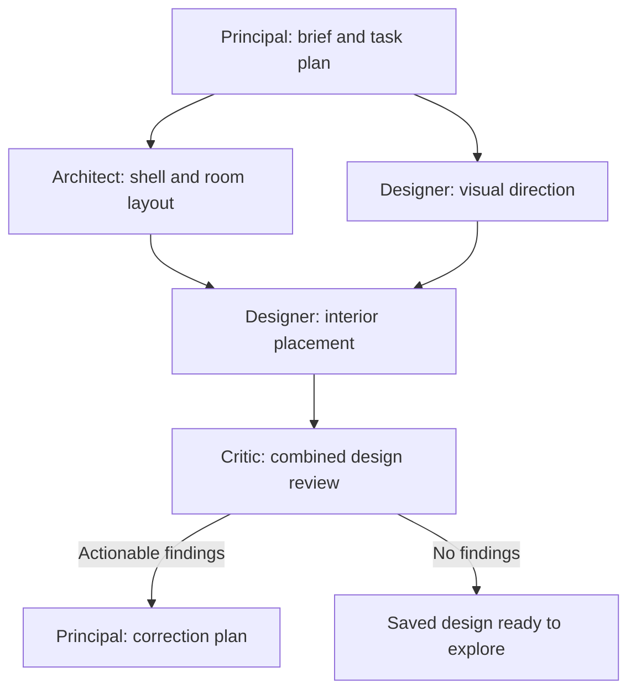

# Dependency-based agent collaboration

The Principal now creates a persisted task graph for each generation or change request. The graph selects the needed specialists, their objectives, deliverables and dependencies. It can branch and rejoin instead of always dispatching the same linear sequence.

For example, a new house can use:

For an existing house, independent structure and finish tasks may start from the same saved revision and run together. A finishes-only change can use the Designer and Critic without regenerating architecture. A selected single-element colour change retains its deterministic material patch and does not allocate a Designer workstation.

## Scheduling and shared state

- Plans contain 2–8 validated tasks. Invalid owners, duplicate IDs, missing dependencies and cycles are rejected. The final Critic review must depend on every other task. New-house interior placement depends on architecture.
- Ready work runs in batches of up to two distinct specialists. Tasks from the same specialist serialize because each room has one workstation. A batch settles before publication and before its downstream tasks start.
- Each batch reads one saved starting revision. Specialists produce separate proposal/result artifacts, not competing copies of the authoritative scene.
- The coordinator merges proposals by stable element/material/space IDs and changed fields against their common ancestor. Non-overlapping changes survive. Conflicting fields, deletion-versus-edit conflicts, invalid combined geometry and ownership changes do not silently overwrite another specialist's work.
- Designer proposals can change materials, material assignments, furniture and lights. Structural geometry, spaces, floor count, spawn and metadata remain protected.
- Task results, dependency references, coordination messages, Principal decisions and canonical revisions persist in D1/R2. Downstream tasks receive the actual saved outputs of their prerequisites. Activity shows task owners, status, prerequisites and deliverables.

Agents with workstations can use `report_coordination` to record a concrete handoff or cross-domain concern. Its successful result records a message and includes it in the saved task result supplied downstream. It does not independently launch another task or grant permission to modify another role's fields. Visual-direction tasks have a structured coordination field for the same purpose.

## Meetings, review and failure

Overlapping proposals trigger a Principal decision with the conflicting paths and both proposals as context. The losing task is rerun once against the latest canonical design, with that decision. A repeated conflict stops the run with its proposals preserved.

The final Critic evaluates the combined saved revision. Findings can trigger one new dependency plan for bounded corrections and another final review. Unresolved findings leave the project in `review`; the system does not run an unlimited correction loop or declare the model ready anyway.

Sibling tasks settle before a batch failure is handled. No proposal from a failed batch is published. Prior successful batches remain saved. Cancellation fences task status updates, design publication and final readiness. Checkpointed steps and persisted plans/decisions/results are reused after interruption; internal task/attempt identifiers cannot collide with model-chosen task names.

The scheduler uses awaited parallel workflow steps and persisted results, following [Cloudflare's workflow and idempotency rules](https://developers.cloudflare.com/workflows/build/rules-of-workflows/).

## Compute limits

The two-computer global limit and existing daily/monthly caps are unchanged. Each workstation reserves its maximum lease up front. After confirmed shutdown, unused reservation time is returned and elapsed time is charged in whole seconds. Failed shutdown retains its reservation and slot while cleanup retries. Legacy leases without a trustworthy start time retain the conservative full charge.

Tasks release their own workstation when done instead of leaving completed machines occupying the next specialist's slot. Saved workstation artifacts remain available in Files. Actual long-running work can still exhaust the configured allowance; this change does not increase spending limits or enable paid generation.

## Setup and verification

Apply `worker/migrations/0004_task_dependencies.sql` with the existing migration command (`npm run db:local` for local development). Deployments must apply the migration before running this Worker version. No new external service is required.

Run `npm run typecheck`, `npm test`, and `npm run build`. Targeted suites include `collaboration.test.ts`, `image-workflow.test.ts`, `backend.test.ts`, `desktop-budget.test.ts`, and `agent-tools.test.ts`.

Tests exercise overlapping task execution, dependency handoffs, same-base merges, conflicts and targeted retries, sibling failure/cancellation, bounded correction, replay, coordinator commit fences, resource accounting and persisted coordination tools. Provider calls are mocked. These checks do not establish live model quality, paid-service access or end-to-end deployment latency.

## Current boundaries

This is a bounded task graph within one active project run. Steering received during work remains queued for the next run; tasks are not interrupted and dynamically replaced midway through a model call. Meetings currently occur for conflicting proposals and final-review corrections. A coordination message alone does not rewrite the running graph.

The graph uses the current brief and this run's instruction; durable effective requirements across many steering rounds still need refinement. Typed questions and clarification resume remain separate work. Spline/imported-model integration and geometric review accuracy are also separate from this scheduling change.
