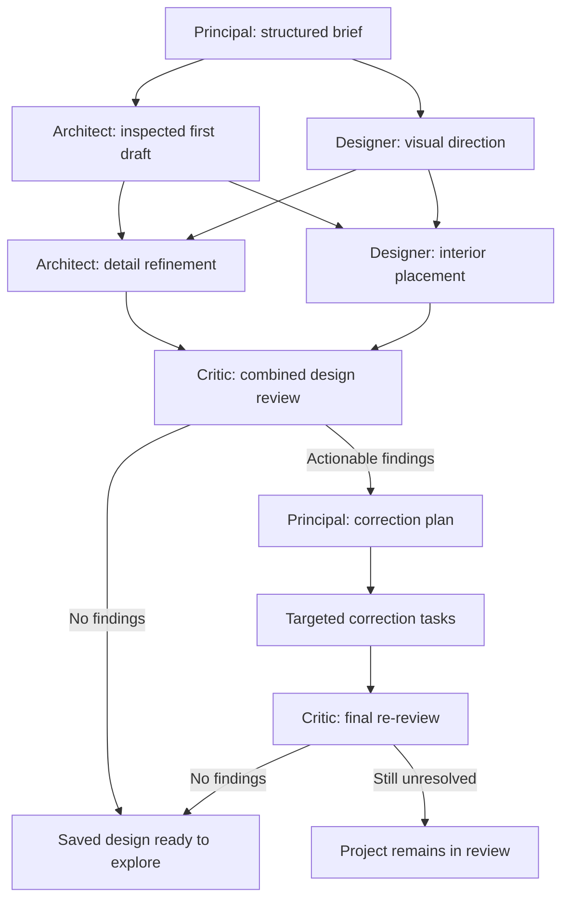

# Dependency-based agent collaboration

Generation and change runs execute a persisted task graph. The Principal selects the needed specialists, their objectives, deliverables and dependencies. A selected single-element colour edit uses a predefined Designer/Critic graph with a deterministic patch. Independent work can branch and rejoin; there is no mandatory four-agent sequence.

For the complete user-facing flow from opening the website to exploring a generated building, see [From entering Atelier to a generated design](user-journey.md).

## From brief to task graph

Structured agent calls have a 64,000-token allowance per response, including reasoning, while retaining the full agent guidance. Task work shares 12 minutes inside a 13-minute checkpoint; individual design requests remain capped at eight minutes. Proposal authoring has 24 tool turns, with tools available on the last turn so an inspected file can still be submitted. Start inspection with at least three minutes remaining. Failed authoring saves a bounded unpublished draft when available; it cannot replace an inspected canonical commit. **Retry team briefing** uses the same project's saved brief and answers in a new attempt. See [model settings and diagnostics](ENVIRONMENT.md#4-models-and-feature-gates-workerwranglerjsonc).

The user saves a brief and starts the team briefing. The Principal normalizes it into `BriefSchema`, asking at most three high-impact questions when necessary. A clarification leaves the run `awaiting_input` with a blocked Principal task and a persistent, versioned question record. Typed and voice answers update that record and the saved brief. Partial answers wait for the remaining questions; completing the required answers saves a continuation request and lets the coordinator dispatch a linked generation run. Replays reuse the same continuation identity, and stale or cancelled answers cannot restart work. The workflow execution that asked the questions has returned; continuation is a new linked run, not an in-memory conversation waiting indefinitely.

The shared conversation handler separates read-only questions, initial brief additions, clarification answers and contextual design changes. Questions do not enter the steering queue, and saving initial requirements does not automatically start generation. Answering an already-started briefing continues its existing user authorization. Continuations respect the current generation configuration and owner-wide active-run limit.

Extra pre-design requirements may be saved during `awaiting_input`: the brief and waiting clarification snapshot update in one batch, retaining answers and incrementing the question version. This does not answer questions or enqueue work. Active or already-queued generation remains fenced against brief edits. Short first voice details are preserved with a descriptive label; the 8,000-character brief cap remains bounded and full-brief failures are explicit.

All newly accepted job kinds persist `workflow_dispatched=0` until Workflow creation or lookup confirms their stable ID. The coordinator arms an alarm before admission and retries only queued, undispatched records using their saved inputs. Ambiguous provider responses leave one accepted request pending, not failed. Cancellation removes dispatch eligibility, and a create/cancel race terminates the late Workflow while D1 continues to fence its work. Public API and voice starts use a structured RPC result so application errors retain their status and safe explanation.

When enabled, an initial concept is generated if no reference is selected. The selected reference is frozen for the run and supplied to every dispatched specialist, including visual-direction and review tasks. Image generation/editing and Blender rendering also have separate requested workflows; their artifacts do not replace the canonical design.

New designs use the runtime's draft-first graph, with the actual Principal-prepared brief and accepted requirements supplied to every task:

For an existing house, independent structure and finish tasks may start from the same saved revision and run together. A finishes-only change can use the Designer and Critic without regenerating architecture. A selected single-element colour change retains its deterministic material patch and does not allocate a Designer workstation.

The initial draft has six minutes of model/tool work; the parallel visual-direction task has two. Both must succeed before the draft's canonical commit, preserving batch failure semantics. The draft still uses the inspected-file proposal contract, but skips optional GUI polishing and custom asset sculpting. Its committed revision emits `draft_ready`, refreshes the existing model view and enables the existing JSON/GLB/floor-plan exports. Refinement and interiors share stable draft room bounds and run together. These are work allowances, not promises of wall-clock delivery: briefing, reference analysis, computer allocation and provider latency still apply. Existing-design and correction plans remain Principal-authored; saved in-flight plans are reused unchanged.

| Task kind | Owner | Output |
| --- | --- | --- |
| `architecture` | Architect | Canonical design proposal for layout, geometry and spatial changes |
| `visual_direction` | Designer | Structured palette, materials, lighting, furnishing direction and coordination artifact |
| `interior` | Designer | Canonical design proposal for materials, material assignments, furniture and lights |
| `review` | Critic | Findings about the saved design and task context |

## Scheduling and shared state

- Plans contain 2–8 validated tasks, including at least one architecture or interior task. Invalid owners, duplicate IDs, missing dependencies and cycles are rejected. A final Critic review must depend transitively on every other task. New-house plans require architecture and interior work, with interior placement depending on architecture.
- Ready work runs in batches of up to two distinct specialists. Tasks from the same specialist serialize because each room has one workstation. A batch settles before publication and before its downstream tasks start.
- Each batch reads one saved starting revision. Specialists produce separate proposal/result artifacts, not competing copies of the authoritative scene.
- Tool-backed design tasks write a complete initial design or explicit incremental edits to `/home/user/project/proposal.json` (1 MiB maximum). `inspect_proposal` validates ownership/schema and returns actual task-specific previews; `submit_proposal` in a later model turn accepts only the same inspected content hash. There are at most two inspection attempts. The final model reply is a small summary, and publication still waits for the batch to settle. Preview artifacts identify themselves as uncommitted proposals with a base revision, task ID and content hash.
- The coordinator merges proposals by stable element/material/space IDs and changed fields against their common ancestor. Non-overlapping changes survive. Conflicting fields, deletion-versus-edit conflicts, schema-invalid combined designs and ownership changes do not silently overwrite another specialist's work. Schema validation does not establish geometric usability.
- Designer proposals can change materials, material assignments, furniture and lights. Structural geometry, spaces, floor count, spawn and metadata remain protected.
- Both renderers understand bounded normalized triangle meshes and explicit material opacity/transmission. Registered assets retain authored materials/UVs unless an explicit appearance override is requested. The installed construction helpers create actual wall apertures, stair voids and pitched/folded roofs; a door/window record alone does not cut a wall.
- Task results, dependency references, coordination messages, Principal decisions and canonical revisions persist in D1/R2. Downstream tasks receive the actual saved outputs of their prerequisites. Activity shows task owners, status, prerequisites and deliverables.

Agents with workstations can use `report_coordination` to record a concrete handoff or cross-domain concern. Its successful result records a message and includes it in the saved task result supplied downstream. It does not independently launch another task or grant permission to modify another role's fields. Visual-direction tasks have a structured coordination field for the same purpose.

## Meetings, review and failure

Overlapping proposals trigger a Principal decision with the conflicting paths, latest accepted design and pending proposal as context. The affected task is rerun once against that saved current design, with the decision. A repeated conflict stops the run with its proposals preserved.

The final Critic evaluates the combined saved revision. Findings can trigger one new dependency plan for bounded corrections and another final review. Unresolved findings leave the project in `review`; the system does not run an unlimited correction loop or declare the model ready anyway.

If a task execution fails, sibling executions settle before the failure is handled, and no proposals from that batch are published. Proposal integration is sequential rather than one atomic batch transaction: if a later proposal still conflicts after its retry, earlier successful commits remain saved. Within the task graph, cancellation fences task status updates, design publication and final readiness. Checkpointed steps and persisted plans/decisions/results are reused after interruption; internal task/attempt identifiers cannot collide with model-chosen task names.

The scheduler uses awaited parallel workflow steps and persisted results, following [Cloudflare's workflow and idempotency rules](https://developers.cloudflare.com/workflows/build/rules-of-workflows/).

## Steering progress and effective requirements

The project snapshot exposes the full saved change-request history, independently of the recent event feed. Activity's [ChangeTracker](../components/ChangeTracker.tsx) shows **Queued → Working → Applied → Reviewed** using persisted milestone evidence, with the submitted instruction, selected specialist/element, base and saved revisions, review findings and errors. A change reaches “Applied” after all planned canonical writes have integrated, before final Critic review. Review is a separate outcome and can report unresolved findings. Stopping or failing a run does not erase milestones or revisions already reached.

Feedback submitted during active work still queues for the next run. It does not interrupt an in-flight task or change that run's plan. Once a subsequent run starts, it freezes a persistent `effective-requirements.json` artifact from the stored brief and ordered previously applied user amendments. The same record, alongside the persisted current run instruction, reaches Principal planning, specialists, visual-requirement analysis, conflict decisions, correction plans and Critic review. Project and voice context also expose the effective requirements. Requested image concepts receive the requirements too and preserve them in artifact metadata.

Apply amendments in order: later instructions supersede earlier instructions or the stored brief only where their subject and scope overlap. A selected-element request remains scoped to that element; it does not recolor every element with a similar material. The current run instruction has priority within its scope, and unrelated requirements remain in force. For example, after “make the exterior red” is applied, “add a balcony” retains the red-exterior amendment even if the original brief requested yellow.

Queued changes and requests that fail or are cancelled before reaching the applied milestone are excluded from the applied amendment history. An applied amendment and its revision evidence remain recorded if review subsequently fails or the run is stopped. An earlier commit can survive a later integration failure without the request reaching “Applied”; inspect task revision artifacts for that partial work. The record preserves client wording and scope; it is not a semantic property map or a guarantee that every requested detail was implemented. Critic findings and partial-work status remain necessary evidence.

## Compute limits

The global limit is two computers. Existing daily/monthly caps remain in force, including 3,600 desktop seconds per user per UTC day and a maximum 900-second lease. Each workstation reserves its maximum lease up front. After confirmed shutdown, unused reservation time is returned and elapsed time is rounded up to whole seconds for charging. Failed shutdown retains its reservation and slot while cleanup retries. Legacy leases without a trustworthy start time retain the conservative full charge.

Tasks release their own workstation when done instead of leaving completed machines occupying the next specialist's slot. Saved workstation artifacts remain available in Files. Actual long-running work can still exhaust the configured allowance; this change does not increase spending limits or enable paid generation.

## Setup and verification

Apply all pending migrations, including [0004_task_dependencies.sql](../worker/migrations/0004_task_dependencies.sql), [0006_change_tracking.sql](../worker/migrations/0006_change_tracking.sql), [0007_conversations.sql](../worker/migrations/0007_conversations.sql) and [0008_project_creation_requests.sql](../worker/migrations/0008_project_creation_requests.sql), with the existing migration command (`npm run db:local` for local development). The conversation migration adds durable questions, continuation links and operation receipts. Migration 0008 persists immutable project-creation requests so reconnecting a browser draft cannot create a second project after a lost reply. Deployments must apply these before running this Worker version. No new external service is required. Generation and rendering remain disabled in the checked-in [Worker configuration](../worker/wrangler.jsonc).

Run `npm run typecheck`, `npm test`, `npm run build` and `npm run worker:check`. Targeted suites include `collaboration.test.ts`, `image-workflow.test.ts`, `backend.test.ts`, `desktop-budget.test.ts`, `artifact-storage.test.ts` and `agent-tools.test.ts` in [tests](../tests/).

Tests exercise overlapping task execution, dependency handoffs, same-base merges, conflicts and targeted retries, sibling failure/cancellation, bounded correction, replay, coordinator commit fences, resource accounting and persisted coordination tools. Provider calls are mocked. These checks do not establish live model quality, paid-service access or end-to-end deployment latency.

## Current boundaries

This is a bounded task graph within a design run. At most one queued or in-progress run per user is allowed across projects. Steering received during work remains queued for the next run; tasks are not interrupted and dynamically replaced midway through a model call. Meetings currently occur for conflicting proposals and final-review corrections. A coordination message alone does not rewrite the running graph.

Effective requirements preserve the stored brief and applied amendments across runs, with a frozen record for each team run. Interpreting overlapping natural-language requirements and free-form conversation intent still depends on the model; the application does not extract a semantic ontology or prove complete compliance. Explicit question and clarification controls provide structured intent, and the backend validates project state, question identity/version and operation replay before a mutation. Completing a clarification requests continuation; configuration or another active run can delay dispatch.

Saved canonical models are walkable through **Design → Walk inside** and the Presentation room’s saved-design action or exhibit E interaction. The exhibit follows the canonical revision, and entry preserves unresolved review status. Spline/imported-model integration and comprehensive geometric review remain unfinished. See the [readiness review](agent-design-review.md) and [walkthrough guide](walkthrough.md).

## Implementation map

- [shared/collaboration.ts](../shared/collaboration.ts): task schemas, dependency validation, field ownership and proposal merging.
- [worker/src/team.ts](../worker/src/team.ts): scheduling, persisted dependency results, meetings, retries and correction plans.
- [worker/src/workflow.ts](../worker/src/workflow.ts): briefing, reference selection, change routing and run orchestration.
- [shared/conversation.ts](../shared/conversation.ts), [worker/src/conversation.ts](../worker/src/conversation.ts) and [worker/src/clarifications.ts](../worker/src/clarifications.ts): shared text/voice interaction contracts, persistent question answers and continuation dispatch.
- [worker/src/coordinator.ts](../worker/src/coordinator.ts): canonical revision commits and cancellation fences.
- [shared/requirements.ts](../shared/requirements.ts) and [worker/src/requirements.ts](../worker/src/requirements.ts): ordered scoped amendments and frozen run requirements.
- [worker/src/changes.ts](../worker/src/changes.ts) and [components/ChangeTracker.tsx](../components/ChangeTracker.tsx): persisted change milestones and their Activity presentation.
- [worker/src/budget.ts](../worker/src/budget.ts), [shared/budget.ts](../shared/budget.ts) and [worker/src/desktop.ts](../worker/src/desktop.ts): resource limits, lease accounting and workstation lifecycle.
- [components/TaskBoard.tsx](../components/TaskBoard.tsx): visible task dependencies and current specialist activity.
- [prompts/README.md](../prompts/README.md): active Markdown role instructions and runtime output contracts.
