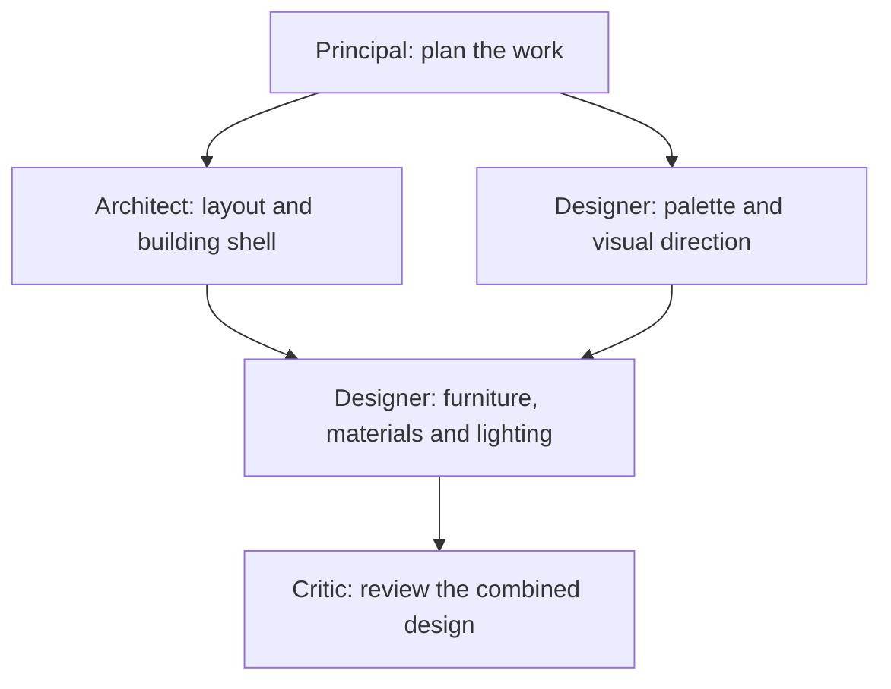

# From entering Atelier to a generated design

This guide follows the current user experience using this example:

> Design a two-floor Pikachu-inspired home for four people, with a generous living room, a gaming room and a yellow exterior.

The steps below describe the implemented flow. Live generation and rendering remain disabled in the checked-in [Worker configuration](../worker/wrangler.jsonc); a complete live run still needs verification. For configuration, see the [README](../README.md). For scheduling and persistence details, see the [collaboration guide](concurrent-agents.md).

## 1. Enter the studio

The user arrives in the 3D office at reception. They can click to walk, switch to first-person **Walk inside**, orbit the scene, or select rooms directly. The team panel introduces the Principal, Architect, Interior Designer and Critic.

A first-time visitor sees a clearly labeled sample project. Returning users can have their last saved project restored. Exploring the sample does not start agents or represent live work. A public deployment requires its configured sign-in; loopback development can use the local preview identity.

## 2. Create a project and give the brief

The user clicks **Start your project** or **New**, enters a project name and describes what they want, then clicks **Create project**.

Alternatively, **Use voice to brief** creates a project and selects the Principal. The user clicks **Live voice** and describes the house. Accepted spoken requirements are saved to the brief.

Saving a project or speaking a brief does not automatically start generation. Live work needs a working backend, an AI connection and the required workstation configuration. The user can inspect their connection in **Settings**.

## 3. Start the team briefing

The user clicks **Start team briefing**. Atelier creates a tracked run and opens **Activity**. The Principal turns the request into a structured brief containing a summary, goals, constraints and any important unresolved questions.

When clarification is necessary, the Principal asks up to three questions and the run enters `awaiting_input` before dispatching design work. The conversation shows the pending questions with their saved answers. Answer through that question card, the normal text composer or voice. An answer is attached to the relevant question ID and clarification version; partial answers remain saved across refreshes.

Once every required question has an answer, Atelier saves the updated brief and queues a linked continuation of the work the user already requested. There is no need to edit the whole brief or click Start again. Repeated submissions reuse the saved operation, and stale or cancelled clarification answers cannot restart work. The continuation still respects generation configuration and the existing one-active-run-per-user limit; a queued continuation is not evidence that specialists have started.

The same composer distinguishes discussion from action. “Why is the roof sloped?” receives an explanation without design work. “Can you make the roof red?” is an explicit change request. Before a first design exists, a new requirement updates the brief without automatically starting initial generation. If an answer or requested change is ambiguous, the Principal can ask a short follow-up. Suggestions such as “What would you recommend?” are not saved as accepted requirements.

## 4. Establish a visual reference when enabled

If no reference has been selected, the first design run can generate an initial concept image after the brief is prepared. The user can also prepare and select a direction beforehand through **Files → Visual concepts**.

Every dispatched specialist receives the same saved reference for that run, including subsequent conflict retries and the bounded correction round. The image guides the work; the editable 3D model is built separately. See [image concepts and edits](image-generation-integration.md).

## 5. Plan the necessary specialist work

The Principal creates a task graph with owners, objectives, deliverables and dependencies. A possible plan for the house is:

Architecture and visual direction can run simultaneously. Interior placement waits because it needs their saved outputs. Up to two different specialists execute in a batch, and dependent work starts after that batch is integrated.

This is an example, not a fixed sequence for every request. Independent structural and finish changes to an existing house can run together. A finishes-only request can involve just the Designer and Critic. There is no compulsory meeting before every task.

## 6. Execute tasks and share real outputs

The Architect proposes the building's layout and geometry. The Designer develops a visual direction, then applies materials, furniture and lighting within its permitted scope. Design tasks use isolated workstations with real filesystem, Python and desktop tools. A visual-direction task produces a structured report without allocating a workstation.

Each batch starts from a common saved design revision. Specialists prepare separate proposals and persistent artifacts. Dependent tasks receive their prerequisites' actual saved outputs and coordination notes.

Communication currently happens through these saved handoffs. A coordination note appears in Activity and is included in downstream dependency context. Naming another specialist does not interrupt it, start a new task or guarantee that an already-running teammate reads the message. The Principal controls dispatch through the plan and bounded coordination decisions.

## 7. Observe progress as the model develops

The user can visit rooms or select specialists while work runs. **Activity → Team tasks** shows owners, objectives, dependencies, waiting states, deliverables and saved revision references. The event feed shows real tool activity and decisions. **Files** exposes saved artifacts. An available live workstation can be opened while its session exists; its default view is the design JSON and room table, rather than an automatic full building viewport.

Accepted proposals update the canonical `project/design.json`. The coordinator validates and saves revisions, and the viewer refreshes from that accepted state. An agent's uncommitted working copy does not directly change the live model. An early saved model can appear before final review finishes.

Compatible edits merge while preserving unrelated work. Conflicting edits produce a saved Principal decision and one targeted retry of the affected task against the current accepted design. A repeated conflict stops the run with saved work available for inspection.

## 8. Review the combined result

The final Critic task waits for all planned work and checks the saved design against the run's frozen effective requirements, current instruction, dependency outputs and available evidence. Effective requirements include the stored brief and previously applied user amendments, with later instructions taking precedence only where their subject and scope overlap.

Findings can trigger one correction round: the Principal assigns targeted fixes, then the Critic reviews again. If findings remain, the project stays in `review`; an empty final finding list permits `ready`. Atelier does not run an unlimited correction loop.

Current review checks are limited. A `ready` status does not guarantee that every architectural, circulation or geometric issue has been detected. See the [readiness review](agent-design-review.md) for the remaining evidence gaps.

## 9. Explore the result and steer the next revision

The user opens **Design → Walk inside** or **Click to walk** to explore the saved building. Available files and exports are in **Files**. A polished Blender presentation render is a separate requested operation; it is not required to display the canonical design in the browser. See the [walking guide](walkthrough.md) for geometry requirements and controls.

For a change, the user can select an exterior element and tell the Designer, “Make this red.” Atelier saves a contextual change request for the existing project. A selected single-element colour change can use a deterministic Designer patch followed by Critic review; broader changes receive a scoped task plan.

If work is already running, steering queues for a subsequent run. It does not interrupt the current model call or rewrite its task graph. Open **Activity → Your changes** to follow the saved request through **Queued → Working → Applied → Reviewed**. The dedicated change tracker retains the instruction, selected specialist/element, saved revisions, review findings and errors. Expand **Current requirements** to inspect the stored brief and applied feedback in order. “Applied” means all planned canonical writes have integrated, before final Critic review; “Reviewed” records a Critic outcome, including any unresolved findings. A failed or stopped request retains evidence of milestones already reached.

Every team run saves an `effective-requirements.json` artifact that keeps the stored brief and previously applied amendments together. Planning, specialists, coordination and review receive the same frozen record alongside the persisted current instruction. If this selected exterior element was changed to red, a later “add a balcony” request receives that red-element requirement instead of relying on the model to infer it from geometry. A whole-exterior instruction has broader scope; selecting one element does not implicitly change the whole exterior.

Requests that never reach the applied milestone do not become applied requirements. If a request reaches “Applied” before review fails or Stop work, its amendment remains recorded with its progress and revision evidence. Partial task revisions can survive an earlier integration failure without the whole request reaching “Applied”; those saved artifacts remain available for inspection. The requirements record tells future agents what was requested and applied; it does not establish that every requirement or geometry check passed.

The office's final Presentation room is not yet connected to this handoff. Today, the user opens the generated building through the **Design** button. The intended in-world presentation entry remains a separate integration step.

## Implementation references

- [Studio.tsx](../components/Studio.tsx): entry, project creation, brief editing, navigation, activity and steering controls.
- [workflow.ts](../worker/src/workflow.ts): briefing, clarification, visual references and run orchestration.
- [conversation.ts](../worker/src/conversation.ts) and [clarifications.ts](../worker/src/clarifications.ts): typed/voice intent operations, saved answers and linked continuation.
- [team.ts](../worker/src/team.ts): task planning, concurrent execution, dependency handoffs, conflicts and correction rounds.
- [collaboration.ts](../shared/collaboration.ts): plan validation, ownership and proposal merging.
- [World.tsx](../components/World.tsx): office and accepted-design rendering.
