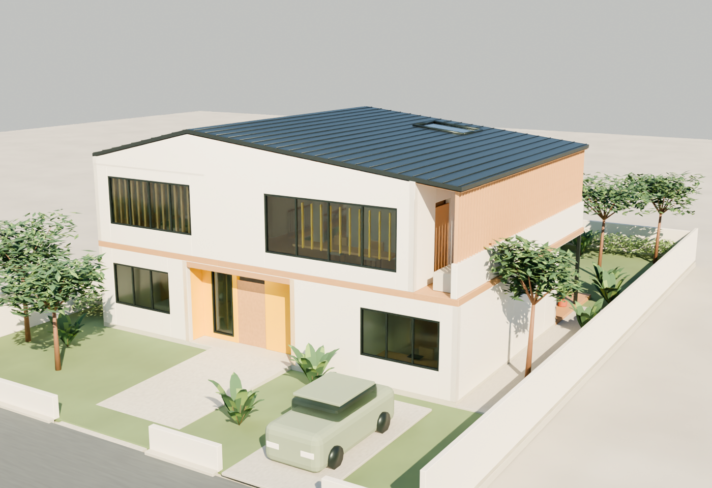

# Folded Light — Pikachu House

A furnished two-storey tropical family home, built in Blender 5.2.1 through
Blender MCP from the [Joo Chiat brief](../docs/draftroom/prompts/projects/03-pikachu-house.md).

[Open the presentation](index.html) · [Blender V2](output/pikachu-house-v2.blend)
· [GLB model](output/pikachu-house.glb) · [Canonical design](design.json)

The reference becomes architecture in three ways:

1. An off-centre roof fold gives the house an energetic silhouette. Graphite
   standing seams and a pale timber soffit keep the gesture domestic.
2. A yellow arrival recess compresses the entrance before the route opens
   past the stair into living, dining and the rear family garden.
3. Yellow appears selectively at the entry, shared-room screens and cushions.
   Private bedrooms use pale timber, linen and muted sage; the upper lounge
   receives a separate rooflight.

No character figure, giant face, attached ears or branded signage is modeled.

## Concept geometry check

| Measure | Model | Brief |
| --- | ---: | ---: |
| Site | 600 m² | 20 × 30 m |
| Ground enclosed floor | 164.4 m² | Approximately 180 m² |
| Upper enclosed floor, stair void excluded | 155.6 m² | Approximately 140 m² |
| Total concept GFA | **320.0 m²** | Target 320; cap 340 m² |
| Covered roof projection | **180.0 m²** | Maximum 180 m² |
| Planted garden, conservative lower bound | **319.56 m²** | At least 240 m² |
| Bedrooms | **3** | 3 |
| Bedroom planning rectangles | Guest 18; primary 28; child 20 m² | 18 / 28 / 20 m² |
| Storeys / car spaces | 2 / 1 | 2 / 1 |
| Roof setbacks, S / N / E / W | 7 / 11 / 2.5 / 2.5 m | At least 3 / 3 / 2 / 2 m |

The floor split shifts to accommodate a 12 m² covered garden room and a 3.6 m²
recessed entrance within the coverage cap. Living/dining occupies a 45.58 m²
planning rectangle, kitchen 18.24 m², study 12.24 m² and upper family lounge
29.07 m². The working allocations are redistributed inside the total GFA.

Ground and upper areas were measured from actual Blender floor meshes. The
roof, seams and fascia were checked together against the covered projection.
The 18-rise stair reaches the 3.42 m upper floor through a 6.4 m² slab opening.
Both private bedrooms have independent ceilings meeting the partition tops.
Every canonical element was found in the Blender scene.

See [geometry-checks.json](output/geometry-checks.json) for measurements and
methods. The garden figure subtracts all declared paving, coverage and boundary
strips; overlapping exclusions deliberately make the remainder conservative.

## Plans and experience

- [Site plan](output/site-plan.png)
- [Ground floor plan](output/ground-floor-plan.png)
- [Upper floor plan](output/upper-floor-plan.png)
- [Street perspective](output/street-perspective.png)
- [Eye-level arrival](output/arrival-eye-level.png)
- [Family room to garden](output/family-room-to-garden.png)
- [Rear garden perspective](output/garden-perspective.png)
- [Upper family lounge](output/upper-family-lounge.png)

The guest bedroom and shower share the entry floor. A graded entrance path
meets that floor, while the internal route avoids the staircase. East and west
facades prioritize solid walls and high-level glazing; the east upper terrace
has a timber privacy screen. Large openings face the street and rear garden.

## V1 → V2

| Design part | V1 | V2 |
| --- | --- | --- |
| Roof / arrival / garden | Folded roof, yellow recess, open rear connection | Preserved |
| East upper terrace | Open above the solid guard | Timber fins filter side-neighbor views |
| Child street window | Clear window | Timber fins add filtered light and separation |
| Shared gallery | Glazing | Fine yellow screen adds a restrained shared-space accent |
| GFA / footprint / rooms | 320 m² / 180 m² / 3 bedrooms | Preserved |

Compare the [V1 view](output/v1-street-perspective.png) with the
[V2 view](output/street-perspective.png). Both native
[V1](output/pikachu-house-v1.blend) and [V2](output/pikachu-house-v2.blend) are
saved, alongside immutable input snapshots in [versions](versions/).

## Editing and rebuilding

The source of truth is `project/design.json`; the `.blend` and `.glb` files are
derived artifacts. Materials and 827 named design elements remain editable.
The Blender scene separates floors, interiors, privacy screens, roof, site,
landscape, lights, cameras and plan labels into collections.

The optional per-element `blender` extension describes non-box meshes, rods,
foliage seeds and display groups. The canonical base fields pass Atelier's
existing design schema. The current application renderer is unchanged; it
does not yet interpret these extra Blender primitives. The GLB preserves the
detailed geometry with portable base materials; Blender retains procedural
material detail.

To rebuild the original inputs, run `python3 scripts/author_pikachu_house.py`
from the repository root. This resets edits to the authored V1/V2 inputs.
For an incremental edit, change `design.json`, then run the compiler's
`build()` function in Blender through MCP. See
[Blender MCP setup](../docs/blender-mcp.md) and the
[compiler](../scripts/render_pikachu_house.py).

This is a concept model of a hypothetical site. It does not establish statutory
GFA classification, structure, weatherproofing, ventilation, daylight,
accessibility or neighbor sightlines. Fixture clearances, door maneuvering,
handrails, gradients and detailed headroom require further review.
